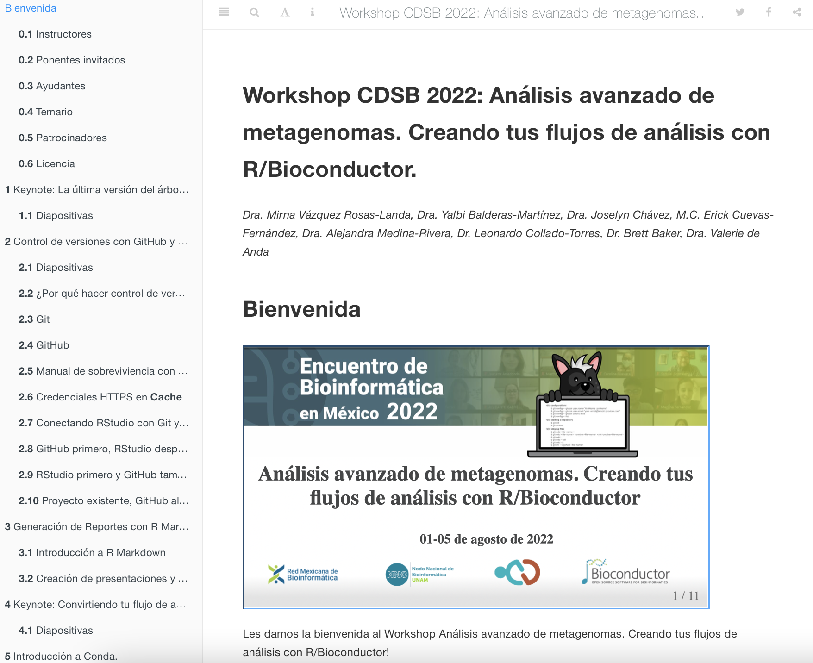

class: center

<br><br><br>
```{r,echo=FALSE,out.width='90%',fig.align='center'}
knitr::include_graphics("css/logo.png")
```
<br><br>
Twitter: [@CDSBMexico](https://twitter.com/CDSBMexico)

Facebook: [@CDSBMexico](https://www.facebook.com/CDSBMexico)

Página web: https://comunidadbioinfo.github.io

---
class: center

# CDSB, ¿Quiénes somos?

La Comunidad de Desarrolladores de Software en Bioinformática, nace de la inquietud por incentivar la participación y colaboración de gente especializada en Bioinformática y Genómica, para contribuir o emprender en el desarrollo de software libre a nivel internacional.

.pull-left[<br>
```{r,echo=FALSE,out.width='25%',fig.align='center'}

```

.pull-left[
```{r,echo=FALSE,out.width='100%',fig.align='center'}
knitr::include_graphics("css/rmb.png")
```
]

.pull-right[
```{r,echo=FALSE,out.width='100%',fig.align='center'}

```
]

]

.pull-right[
```{r,echo=FALSE,out.width='100%',fig.align='left'}
knitr::include_graphics("img/somos.png")
```
]

---
class: center

# Fundadores

<br>
```{r,echo=FALSE,out.width='100%',fig.align='center'}

```

---
class: center

# Junta directiva actual

```{r,echo=FALSE,out.width='80%',fig.align='center'}

```

---
# Eventos 2018-2022

```{r,echo=FALSE,out.width='90%',fig.align='center'}

```

---
class: center

# Colaboradores y patrocinadores

.pull-left[<br>

.pull-left[
```{r,echo=FALSE,out.width='100%',fig.align='center'}
knitr::include_graphics("css/rmb.png")
```
<br><br><br>
```{r,echo=FALSE,out.width='85%',fig.align='center'}

```
]

.pull-right[
```{r,echo=FALSE,out.width='100%',fig.align='center'}

```

```{r,echo=FALSE,out.width='70%',fig.align='center'}
knitr::include_graphics("img/rladiesmx.png")
```
]

```{r,echo=FALSE,out.width='100%',fig.align='center'}
knitr::include_graphics("img/sponsors.png")
```
]

.pull-right[
```{r,echo=FALSE,out.width='90%',fig.align='center'}

```
]

---
class: chapter-slide

# ¿Cómo nos preparamos?

---
class: chapter-slide

# Antes del evento

---
# Página del evento con blogdown

.left-column[<br><br><br>
```{r,echo=FALSE,out.width='100%', fig.align='center'}
knitr::include_graphics("img/blogdown.png")
```
]

.right-column[
.center[https://comunidadbioinfo.github.io]

```{r,echo=FALSE,out.width='80%', fig.align='center'}

```
]

---
# Preparación de materiales con bookdown

.left-column[<br><br><br>
```{r,echo=FALSE,out.width='100%', fig.align='center'}
knitr::include_graphics("img/bookdown.png")
```
]

.right-column[
.center[https://comunidadbioinfo.github.io/cdsb2022]

```{r,echo=FALSE,out.width='70%', fig.align='center'}

```
]

---
# Preparación de diapositivas con xaringan

.left-column[<br><br><br>
```{r,echo=FALSE,out.width='100%', fig.align='center'}
knitr::include_graphics("img/xaringan.png")
```
]

.right-column[
```{r,echo=FALSE,out.width='100%', fig.align='center'}

```
]

---
# Diapositivas con código

.pull-left[<br><br>
```{r,echo=FALSE,out.width='100%', fig.align='center'}

```

.center[https://pkg.garrickadenbuie.com/xaringanExtra]
]

.pull-right[
En el archivo .Rmd:

```{r,echo=FALSE,out.width='100%', fig.align='center'}

```

En la presentación final:

```{r,echo=FALSE,out.width='100%', fig.align='center'}

```
]

---
# Generación de calendario y ligas

.left-column[<br>
```{r,echo=FALSE,out.width='80%', fig.align='center'}
knitr::include_graphics("img/zoom.png")
```

```{r,echo=FALSE,out.width='60%', fig.align='center'}
knitr::include_graphics("img/Google_Calendar.png")
```
]

.right-column[
```{r,echo=FALSE,out.width='70%', fig.align='center'}

```

.center[
### Sesiones de ayuda previo al inicio
]
]

---
# Invitación al Slack de la CDSB

.pull-left[<br>
```{r,echo=FALSE,out.width='110%'}
knitr::include_graphics("img/canales.png")
```
]

.pull-right[
```{r,echo=FALSE,out.width='50%',fig.align='center'}
knitr::include_graphics("img/slack.png")
```
.center[
Únete [aquí](https://join.slack.com/t/comunidadbioinfo/shared_invite/zt-1foe6gqnm-6gBuGQzvhQQSGtr9Dzbz6w)
]

Canales importantes:
- Bienvenida
- General
- Canales específicos por taller
]

---
class: chapter-slide

# Durante el evento

---
# Código en vivo 

.left-column[<br><br><br>
.center[
Disponibilidad del código completo en el libro y diapositivas
]
]

.right-column[
```{r,echo=FALSE,out.width='85%',fig.align='center'}

```
]

---
# Solución de dudas 

<br>
.pull-left[
### Problemas de código durante la sesión

<br>
.center[**Nuestros ayudantes**]
```{r,echo=FALSE,out.width='100%',fig.align='center'}

```
]

.pull-right[
### Discusión activa mediante Slack

```{r,echo=FALSE,out.width='100%',fig.align='center'}

```
]

---

# Grabación de las sesiones y disponibilidad

<br>
.pull-left[
```{r,echo=FALSE,out.width='100%',fig.align='center'}

```
]

.pull-right[<br><br>
```{r,echo=FALSE,out.width='100%',fig.align='center'}

```
]
---
class: chapter-slide

# Después del evento

---
# Edición y publicación de videos 

```{r,echo=FALSE,out.width='80%',fig.align='center'}
knitr::include_graphics("img/youtube.png")
```
.center[https://www.youtube.com/channel/UCHCdYfAXVzJIUkMoMSGiZMw]

---
# Creación de blogpost con experiencias

```{r,echo=FALSE,out.width='70%',fig.align='center'}

```

### **Encuestas de retroalimentación**

---

.pull-left[<br><br><br><br>
.center[
# ¡Gracias!
]

```{r,echo=FALSE,out.width='50%',fig.align='center'}

```
]

.pull-right[
```{r,echo=FALSE,out.width='90%',fig.align='center'}

```
]


